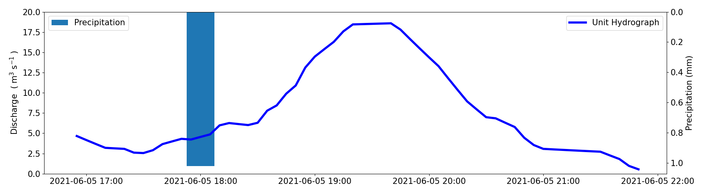

# Unit Hydrograph Presentation

A reproducible presentation on unit hydrographs.
Download this repo to reproduce the figures in the presentation.




## Getting Started
Ensure that Python3 is installed and present on the path.
QGIS is used for the map figures.
All figures are created in the `figures/out` directory.

## Dependencies

```
Powershell
```

```
pip3 install requests python3-bs4 pytz pandas numpy scipy matplotlib
```

## To build

Run
```
run.ps1
```

in the `webscrape-precip-data` directory.

Then, run
```
build.ps1
```

in the `figures` directory.


## Contact

Please let me know if you require any assistance with running the code.

## Author

* **Nicholas J. Kinar <n.kinar@usask.ca>**
